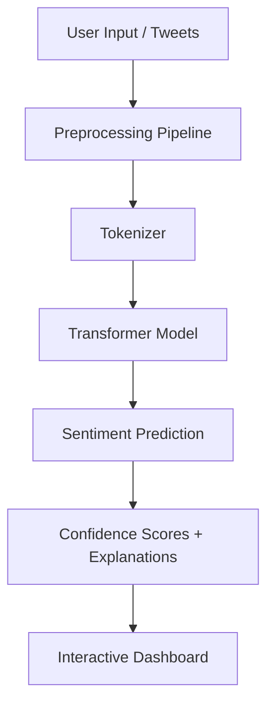

# Logos_X_ai

**An AI-Powered Social Sentiment Intelligence System**


**Logos_X_ai** is a transformer-based sentiment intelligence system designed to analyse public discourse on social media with state-of-the-art NLP models. It investigates how **domain-specific transformer architectures** compare against general-purpose models when handling noisy, contextual, and informal language found in tweets, hashtags, slang, emojis, and abbreviations.

This repository applies research on transformer fine-tuning for Twitter/X sentiment classification and selects the most potent transformer model to power this production-ready AI application.

---

## ✨ Features

- **Transformer-powered multi-class sentiment analysis** (Positive, Negative, Neutral)
- **Comparative benchmarking** across multiple transformer models
- **Confidence score visualisation** with explainability
- **Batch tweet analysis** and interactive dashboard
- **Explainable NLP pipeline** (attention & prediction insights)
- **Public discourse monitoring & social listening**
- **Professional Streamlit dashboard**

---

## 🧠 Models Evaluated

| Model              | Type                        | Key Advantage                     |
|--------------------|-----------------------------|-----------------------------------|
| **BERT**           | General-purpose baseline    | Strong contextual understanding   |
| **DistilBERT**     | Lightweight baseline        | Fast & computationally efficient  |
| **Twitter-RoBERTa**| Domain-specific (Twitter)   | Best performance on twitter data   |

All models are **fine-tuned on the TweetEval sentiment dataset**.

**Best Performer**: **Twitter-RoBERTa** – achieves the strongest balanced results across sentiment classes.

---

## 📊 Comparative Results

| Model              | Accuracy | Macro F1 | Macro Recall |
|--------------------|----------|----------|--------------|
| **BERT**           | 0.69     | 0.69     | 0.71         |
| **Twitter-RoBERTa**| **0.70** | **0.70** | **0.73**     |
| **DistilBERT**     | 0.68     | 0.68     | 0.69         |

---

## 🎯 Impact

Social media contains vast amounts of emotionally charged, noisy, and context-rich public opinion. Accurate sentiment understanding using this system provides the following services:

- **Political risk assessment**
- **Brand intelligence & reputation monitoring**
- **Public opinion tracking**
- **Market research**
- **Trust & Safety analytics**
- **Social listening systems**

This project explores how specialised transformers can better model collective human sentiment in ambiguous linguistic environments.

---

## 🏗️ Project Architecture



## 📁 Repo Structure
```
Logos_X_ai/
├── app/
│   ├── main.py                 # Streamlit dashboard
│   ├── inference.py            # Model inference logic
│   ├── preprocessing.py        # Text cleaning & preparation
│   └── visualisations.py       # Charts and explainability
├── models/                     # Fine-tuned model weights
├── notebooks/                  # Research & experimentation
├── data/                       # Datasets & processed files
├── assets/                     # Images, logos, screenshots
├── requirements.txt
├── README.md
└── .gitignore
```
## 🚀 Installation & Setup

1. Clone the repository
```
git clone https://github.com/yourusername/Logos_X_ai.git
cd Logos_X_ai
```

2. Create virtual environment
```
python -m venv venv
source venv/bin/activate    # Windows: venv\Scripts\activate
```

3. Install dependencies
```
pip install -r requirements.txt
```

4. Run the application
```
streamlit run app/main.py
```

## 🛠️ Tech Stack

1. Language: Python
2. ML Framework: PyTorch + Hugging Face Transformers
3. Models: BERT, DistilBERT, Twitter-RoBERTa
3. Frontend: Streamlit
4. Data: Pandas, Scikit-learn
5. Visualisation: Matplotlib + Plotly


## 📄 License
This project is licensed under the MIT License – see the LICENSE file for details.
